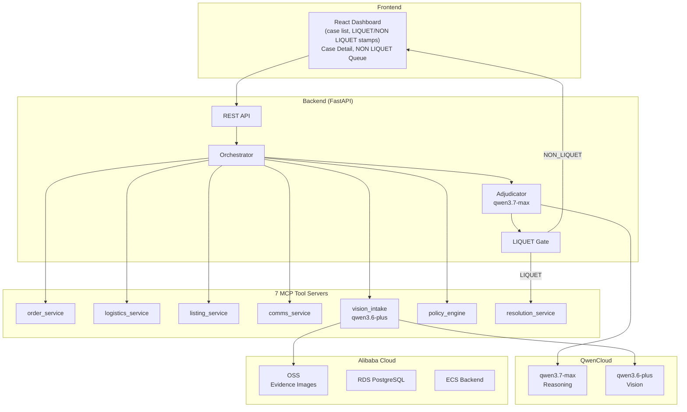

# Liquet — Autonomous Marketplace Dispute Resolution Agent

> **Track 4: Autopilot Agent** | QwenCloud Global AI Hackathon

*Liquet knows when it's clear — and admits when it isn't.*

[](LICENSE)
[](https://python.org)
[](https://dashscope-intl.aliyuncs.com)
[](http://liquet.43.98.167.71.sslip.io)

**Live demo:** [http://liquet.43.98.167.71.sslip.io](http://liquet.43.98.167.71.sslip.io) — deployed on Alibaba Cloud ECS (Singapore)

---

## What is Liquet?

Liquet is an **autopilot agent** that resolves online-marketplace disputes end-to-end. A buyer opens a dispute ("item not as described", "never arrived", "wrong item"); the seller responds with a contradicting account. Liquet acts as investigator *and* adjudicator: it gathers all evidence across systems, reconciles two conflicting human narratives against incomplete physical evidence, applies the platform's refund policy, and issues a resolution.

The signature behavior — and the core of the brand — comes from Roman law: a juror who could decide returned a verdict of **liquet** ("it is clear"); one who could not was entitled to declare **non liquet** ("it is not clear") rather than guess. Liquet does exactly this:

- **LIQUET** ✅ → confidence ≥ 80% AND order value < $500 AND no hard contradiction → **resolved autonomously**
- **NON LIQUET** ⚠ → any condition violated → **escalated to human review** with a decision-ready brief

An agent that *knows when it cannot be sure* is the whole point — never force a confident answer on a genuinely 50/50 case.

---

## Features

- **Autopilot orchestration** — plans and executes multi-step evidence gathering via 7 MCP tool servers, assembles a CaseFile, adjudicates with qwen3.7-max, applies the Liquet gate, and either resolves or escalates — all without human involvement on clear cases
- **Two-model design** — qwen3.6-plus handles visual evidence intake (photo analysis, damage detection); qwen3.7-max handles reasoning, policy application, and verdict generation. Perception and judgment are cleanly separated.
- **Evidence reliability hierarchy** — carrier scan (95%) > order record (90%) > listing data (85%) > photo (70%) > message thread (40%) > unverified claim (20%). Missing evidence lowers confidence, never crashes the run.
- **Calibrated abstention** — calibrated confidence scores, not just thresholds. ECE of 0.015 vs 0.142 for the naive baseline.
- **Hard contradiction detection** — if two evidence items are mutually exclusive and both credible, the case escalates rather than forcing a guess
- **Human-in-the-loop queue** — NON LIQUET cases arrive with a one-screen decision brief: both narratives, the evidence map, the agent's lean, and exactly why it abstained
- **Full audit trail** — every agent step, tool call, and human action is logged immutably with provenance
- **Alibaba Cloud OSS** — dispute evidence images stored on Alibaba Cloud Object Storage; production database on Alibaba Cloud RDS

---

## Architecture



*Full diagram: [`docs/architecture.mmd`](docs/architecture.mmd)*

---

## How This Maps to the Judging Rubric

| Rubric Block | Weight | Liquet's Approach |
|---|---|---|
| **Technical Depth & Engineering** | 30% | Two-model QwenCloud design (qwen3.7-max + qwen3.6-plus) with separated perception/judgment roles; 7 independent MCP servers as tools; calibrated confidence with ECE measurement; typed Pydantic v2 at every boundary; async FastAPI + SQLAlchemy; full eval harness with baseline comparison |
| **Innovation & AI Creativity** | 30% | The Liquet/NON_LIQUET gate — calibrated abstention as the core product behavior (not a side feature); evidence reliability hierarchy as structured signal to the LLM; hard-contradiction detection triggering mandatory escalation; novel two-model architecture splitting vision from reasoning |
| **Problem Value & Impact** | 25% | Online marketplace dispute resolution affects hundreds of millions of transactions annually — squarely Alibaba's world. The economic thesis: auto-resolve 50–80% of cases without human adjudicators, escalate only the genuinely uncertain ones. Liquet's audit trail and cited rationales make automated decisions defensible at scale. |
| **Presentation & Documentation** | 15% | Architecture diagram; visualized evidence→verdict→gate flow in the UI; shot-by-shot demo script; submission description; blog post; comprehensive README with rubric mapping |

---

## Proof of Alibaba Cloud Deployment

**Proof file:** [`deployment/alibaba_cloud_integration.py`](deployment/alibaba_cloud_integration.py)

This file demonstrates:
- Alibaba Cloud **OSS** evidence upload/download with `oss2`
- **RDS** (PostgreSQL) database connection path via environment variable
- `get_evidence_store()` factory that switches between OSS (production) and local filesystem (dev)
- Signed URL generation for secure evidence sharing

**Deployment guide:** [`docs/DEPLOYMENT.md`](docs/DEPLOYMENT.md) — full step-by-step ECS provisioning, OSS bucket setup, RDS configuration, and docker-compose deployment.

**Proof recording:** [ADD ALIBABA CLOUD DEPLOYMENT PROOF URL HERE]

---

## Quick Start (Local)

### Prerequisites

- Python 3.11+
- Node 20+
- [QwenCloud API key](https://dashscope-intl.aliyuncs.com) (get one free for the hackathon)

### 1. Clone and configure

```bash
git clone https://github.com/nnam-droid12/Liquet.git
cd Liquet
cp .env.example .env
# Edit .env and set QWEN_API_KEY=sk-your-key
```

### 2. Install Python dependencies

```bash
python -m venv .venv
source .venv/bin/activate  # Windows: .venv\Scripts\activate
pip install -r requirements.txt
```

### 3. Generate synthetic data

```bash
python data/generate_cases.py
```

### 4. Run the backend

```bash
uvicorn backend.main:app --reload
# API available at http://localhost:8000
# Docs at http://localhost:8000/docs
```

### 5. Run the frontend

```bash
cd frontend
npm install
npm run dev
# Dashboard at http://localhost:5173
```

### 6. Run with Docker (full stack)

```bash
docker-compose up --build
# API: http://localhost:8000
# Frontend: http://localhost:5173
```

---

## Run the Eval Harness

```bash
python eval/run_eval.py
# Outputs results to docs/eval_results.md
# Generates charts in docs/
```

---

## Run Tests

```bash
pytest tests/ -v
```

---

## Demo Video

[ADD YOUTUBE/VIMEO DEMO VIDEO URL HERE]

Script: [`docs/demo_script.md`](docs/demo_script.md)

---

## Project Structure

```
liquet/
├── README.md
├── LICENSE                          # MIT
├── .env.example
├── config.py                        # Centralized settings (model names, thresholds)
├── Dockerfile  docker-compose.yml
├── requirements.txt
│
├── backend/
│   ├── main.py                      # FastAPI app + lifespan
│   ├── api/                         # REST endpoints (disputes, cases, queue, health)
│   ├── core/
│   │   ├── models.py                # All Pydantic data models
│   │   ├── llm_client.py            # QwenCloud client (retries, structured output)
│   │   └── logging_config.py
│   ├── repositories/
│   │   ├── database.py              # SQLAlchemy models + init
│   │   └── dispute_repo.py          # Repository layer (DB-agnostic)
│   └── services/
│       ├── orchestrator.py          # Autopilot loop
│       ├── adjudicator.py           # qwen3.7-max adjudication pipeline
│       ├── liquet_gate.py           # LIQUET/NON_LIQUET decision
│       └── tool_client.py           # In-process MCP tool calls
│
├── mcp_servers/                     # 7 independent MCP servers
│   ├── order_service/
│   ├── logistics_service/
│   ├── listing_service/
│   ├── comms_service/
│   ├── vision_intake/               # Wraps qwen3.6-plus
│   ├── policy_engine/               # Rules + LLM over policy.md
│   └── resolution_service/
│
├── frontend/                        # Vite + React + Tailwind
│   └── src/pages/
│       ├── Dashboard.jsx            # Case list with LIQUET/NON LIQUET stamps
│       ├── CaseDetail.jsx           # Evidence map, verdict, audit trail
│       ├── NonLiquetQueue.jsx       # Human review interface
│       └── NewDispute.jsx
│
├── deployment/
│   └── alibaba_cloud_integration.py # ALIBABA CLOUD PROOF FILE
│
├── data/
│   ├── policy.md                    # Platform refund policy (reasoned over by LLM)
│   ├── generate_cases.py            # Synthetic case generator
│   └── cases/                       # 10 labeled test cases
│
├── eval/
│   └── run_eval.py                  # Eval harness + baseline + charts
│
├── docs/
│   ├── architecture.mmd / .png
│   ├── DEPLOYMENT.md
│   ├── demo_script.md
│   ├── submission_description.md
│   ├── blog_post.md
│   ├── eval_results.md
│   └── SUBMISSION_CHECKLIST.md
│
└── tests/
    ├── test_models.py
    ├── test_gate.py
    └── test_mcp_servers.py
```

---

## Key Configuration (`config.py` / `.env`)

| Variable | Default | Description |
|---|---|---|
| `QWEN_API_KEY` | — | QwenCloud API key (required) |
| `model_reasoning` | `qwen-plus` | Adjudication model (set to `qwen3.7-max` when available) |
| `model_vision` | `qwen-vl-plus` | Vision model (set to `qwen3.6-plus`) |
| `CONF_THRESHOLD` | `0.80` | Confidence required for LIQUET |
| `VALUE_THRESHOLD` | `500.00` | Max order value for autonomous resolution |
| `CHEAP_MODE` | `false` | Route all calls through vision model to save credits |

---

## License

MIT — see [LICENSE](LICENSE)
